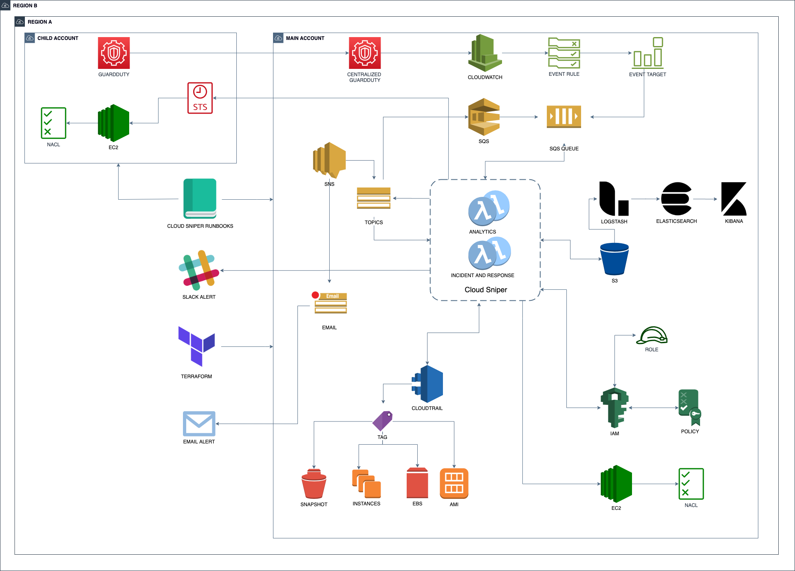
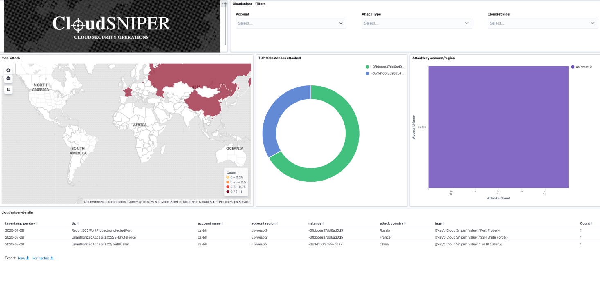

# *Cloud Sniper*

## *How it works*

### Cloud Sniper - AWS native version

***Cloud Sniper*** receives cloud-based feeds to take remediation security actions. Currently gets findings from GuardDuty, a continuous security monitoring service that detects threats based on *CloudTrial Logs/VPC Flow Logs/DNS Logs artifacts*.

When *GuardDuty* detects an incident, ***Cloud Sniper*** automatically analyzes what actions are available to mitigate and remediate that security threat. If layer 7/4/3 attacks are taking place, it blocks the corresponding sources, both in the WAF and in the Network Access Control Lists of the affected instances.

A knowledge database will be created to store the *IOCs* that affect the cloud environments and will build its own *Threat Intelligence* feeds to use in the future.

The ***Cloud Sniper Analytics*** module allows to analyze VPC flow logs of the entire network where an affected instance is deployed and obtain analytics on traffic behavior, looking for *Command and Control (C2)* activity.

### *Terraform - AWS infrastructure deployment*

   

### AWS deployment

Cloud Sniper uses Terraform to automatically deploy the entire infrastructure. The core is programmed in python, so it can be extended according to the needs of each environment.

You must have:

1. AWS cli  installed
2. A programmatic_access_key|role
3. AWS local profile configured
4. Terraform client installed

To deploy Cloud Sniper you must run:

1. ~$ git clone https://github.com/cloud-sniper/cloud-sniper.git
2. ~$ cd cloud-sniper
3. Set the environment variables corresponding to the account in the variables.tf file
4. Create main.tf file

   provider "aws" {
   region                    = "region"
   shared_credentials_file   = "/your-home/.aws/credentials"
   profile                   = "your-profile"
   }
5. ~/cloud-sniper$ terraform init
6. ~/cloud-sniper$ terraform plan
7. ~/cloud-sniper$ terraform apply [yes]

### AWS artifacts integration:

The platform is integrated with the following AWS cloud resources:

1. GuardDuty
2. SQS
3. CloudWatch
4. Lambda
5. EC2
6. VPC Flow Logs
7. DynamoDB
8. IAM
9. S3
10. CloudTrail
11. WAF
12. Kinesis Firehose

### Dashboard  - ELK:

We add a basic opendistro ELK terraform deploy to allow to any get some basic visibility into the findings, if you already have your own SIEM you can use the pipeline inside the 'dashboard/logstash' folder. Import our dashboard to get fast insights. 

To deploy Cloud Sniper you must run:

1.  ~$ git clone https://github.com/cloud-sniper/cloud-sniper.git
2.  ~$ cd cloud-sniper/dashboard
3.  Set the environment variables corresponding to the account in the variables.tf file
4.  Create main.tf
5.  ~/cloud-sniper/dashboard$ terraform init
6.  ~/cloud-sniper/dashboard$ terraform plan
7.  set your aws ssh-key for get access to the instance and your VPC-ID. (the EC2 access is restricted to the current public IP) 
8.  ~/cloud-sniper/dashboard$ terraform apply [yes]
9.  when the EC2 initialized you need to manually copy the logstash/logstash.conf file inside the '/etc/logstas/conf.d/logstash.conf' *Remember put your s3 folder name and setup with  your user/password*. 